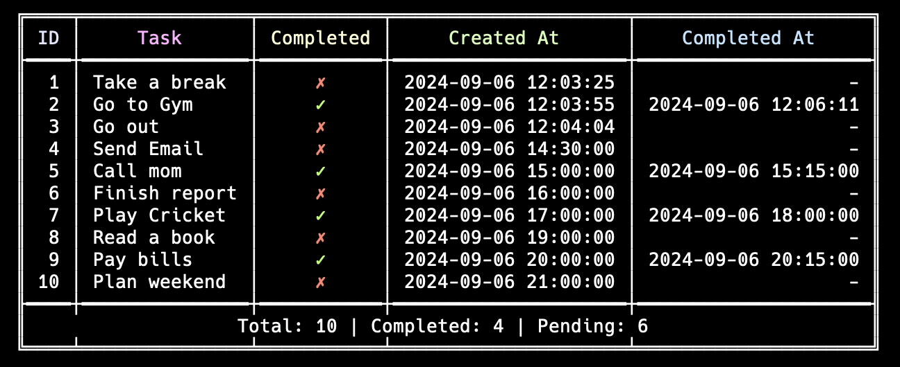

# go-awesome-todo-cli

A powerful and colorful command-line todo list application written in Go.

## Features

- Add new tasks
- Mark tasks as completed
- Delete tasks
- List all tasks in a beautiful, colorful table
- Persistent storage using JSON file

## Installation

1. Clone the repository:
   ```
   git clone https://github.com/arpitptl/go-awesome-todo-cli.git
   ```

2. Navigate to the project directory:
   ```
   cd go-awesome-todo-cli
   ```

3. Build the application:
   ```
   make build/todo
   ```

## Usage

### Add a new task
```
./todo -add "Your task description"
```

### Mark a task as completed
```
./todo -complete 1
```

### Delete a task
```
./todo -delete 1
```

### List all tasks
```
./todo -list
```

## Screenshots

### List of tasks

